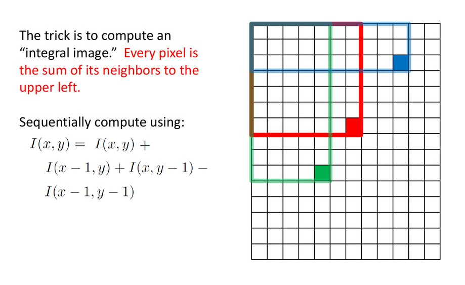
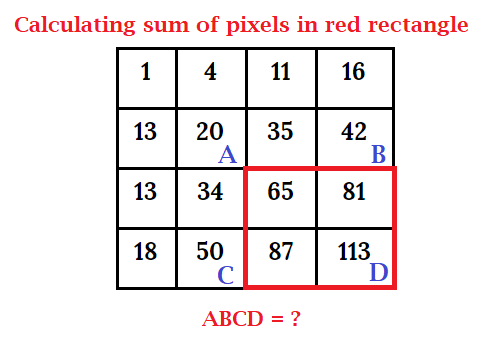

# Viola Jones Framework

<h2>Contents</h2>
<ul>
  <li><a href="#s1">Viola Jones Framework</a> (explained)
  <ol>
    <li><a href="#ss1">Haar-like features</a></li>
    <li><a href="#ss2">Integral image</a></li>
    <li><a href="#ss3">AdaBoost Learning Algorithm</a></li>
    <li><a href="#ss4">Cascade Classifier</a></li>
  </ol>
  </li>
  <li></li>
</ul>

<h2 id="s1">Viola Jones Framework</h2>

The <b>Viola-Jones Object Detection Framework</b>, developed by <b>Paul Viola</b> and <b>Michael Jones</b> in <a href="#ref1">2001</a>, is an innovative machine learning algorithm specifically designed for fast, accurate face detection. It was primarily motivated by the problem of face detection, although it can be adapted to detect other classes of objects.   Training the framework is relatively slow, but it enables objects to be detected quickly and accurately. In fact, it can detect human faces very effectively, and in real time. 

Viola–Jones is essentially a <b>boosted feature learning algorithm</b> trained by running a modified <b>AdaBoost</b> algorithm on <b>Haar feature classifiers</b> to find a sequence of classifiers <i>f1, f2, ..., fn</i>. 

The framework consists of four key components that work together to achieve efficient and accurate object detection:
<ol>
  <li>Haar-like features</li>
  <li>Integral image</li>
  <li>AdaBoost Learning Algorithm</li>
  <li>Cascade Classifier</li>
</ol>
<h3 id="ss1">1. Haar-like features</h3>
Most images contain universally similar patterns recognizable from a human perspective. 
For example:
<ul>
  <li><b>Human Faces</b>: Common patterns include eyes, nose, cheeks, and mouth.</li>
  <li><b>Four-Wheeler Vehicles</b>: Recognizable patterns include wheels, doors, and steering wheels.</li>
  <li><b>Buildings</b>: Consistent features include doors, windows, and walls.</li>
</ul>
The concept of <b>Haar-like features</b> was introduced by <b>Alfred Haar</b> in 1909. He developed the "Haar wavelet," a matrix of rescaled square-shaped functions with values ranging between 0 and 1. 
<b>Haar-like features</b>, named for their resemblance to 2D Haar wavelets, use simple rectangular patterns to detect structural components of objects, such as edges, lines, and textures. They are applied to various sub-windows of the image to assess the presence of specific patterns crucial for object recognition. 

There are several types of Haar-like features (see figure), including:
<ul>
  <li>Edge features</li>
  <li>Line features</li>
  <li>Four rectangle features</li>
  <li>Center features</li>
</ul>

For example, human faces share several common attributes, such as the eye region being darker than the bridge of the nose, and cheeks being brighter than the eye region. Similarly, every part of the face can be represented as haar like a feature considering their generic patterns. 

A haar-like feature will be represented as a matrix where all white-colored pixels will be represented as 0 and black-colored pixels will be represented as 1.
By summing the pixel values of different regions and comparing them, the algorithm can effectively identify areas where these attributes hold true. 

For instance, the sum of pixel values in a darker region will be smaller than in a lighter region, which can be used to detect specific facial features. 

For example, We can see in the image below that there is an edge formation near the nose to cheek part. The intensity becomes larger when it comes from left to right. 

After detecting an object using Haar-like features, it is crucial to evaluate the model to assess its accuracy. This involves subtracting the sum of pixel values in the black region from the sum of pixel values in the white region. If the feature value is close to the expected value (near 1), it indicates a strong presence of the property being detected. For a uniform surface(e.g., a wall) this value will be close to zero and won't provide any significant information. 

$Feature\textunderscore Value = (\sum Pixel\textunderscore White\textunderscore Region - \sum Pixel\textunderscore Black\textunderscore Region) / Number\textunderscore of\textunderscore Pixel$

In our example, the sum of pixel values in the black region and the white region: 
$B = 0.6+0.8+0.8+0.6+0.6+0.8+0.8+0.9=5.9$ 
$W = 0.1+0.2+0.2+0.3+0.2+0.1+0.2+0.1=1.4$ 
$Metric = (B - W)/8 = (5.9-1.4)/8 = 0.56$ 
Therefore, we can infer that there is a 56% probability of detecting the Haar-like feature in the specific area of the image.

Each haar feature type is applied to different locations and sizes within all images. By sliding these rectangular windows over various positions and scales of the image, the algorithm computes feature values based on the intensity differences between the regions. 

This process is repeated across multiple locations and sizes, allowing the detection of features with varying scales and orientations, which helps in recognizing patterns and structures crucial for object detection.

The Viola-Jones algorithm calculates many such features across multiple subregions of an image, making the process computationally intensive. To address this, the algorithm employs the concept of <b>Integral Images</b>, which allows for rapid calculation of these features.

<h3 id="ss2">2. Integral image</h3>
Consider an image of size 24 × 24 pixels (as used in the original <a href="ref1">paper</a>). For a horizontal two-rectangle feature, there are 12 possible valid widths for a pixel-wide window: 2, 4, 6, 8, 10, 12, 14, 16, 18, 20, 22, and 24. Given that the feature height is 1 pixel, there are 24 possible positions for this height without violating symmetry. However, not all positions are valid when considering the feature’s placement.
<ul>
  <li>A 2-pixel wide feature can be positioned at 23 different coordinates (23 possible positions).</li>
  <li>A 24-pixel wide feature can be positioned at only 1 coordinate (1 possible position).</li>
  <li>A 22-pixel wide feature can be positioned at 3 different coordinates (3 possible positions).</li>
</ul>

we can calculate the possible combinations as follows:
$n_{x}(width_{feature}) = width_{window} - width_{feature} + 1$  
Therefore, the total number of possible combinations for a specific $width_{feature}$, giving 
$N_{x,2h} = n_{x}(2) + n_{x}(4) + n_{x}(6) + ... + n_{x}(24)$ 
$N_{x,2h} = 23 + 21 + 19 ... + 1 = 144$ 
Similarly, for the height, the number of possible positions $n_{y}(height_{feature}) = 300$ 
Consequently, the total number of combinations for positioning the horizontal two-rectangle feature is 
$N_{2h} = N_{x,2h} \times N_{y,2h} = 144 \times 300 = 43200$  

When summing all these, the total number of valid combinations for the x-coordinate positioning alone is significant. Considering all possible filter parameters (position, scale, and type), this leads to over 160,000 features being calculated within this window, as claimed in the paper, making the computation of pixel differences for all features extremely expensive. 

To mitigate this computational cost, the concept of an integral image (or summed-area table) was introduced. An integral image provides a fast and straightforward method to calculate the value of any Haar-like feature. Instead of computing the sum at every pixel, it uses sub-rectangles and creates array references for each of these sub-rectangles. These references are then used to compute the Haar features efficiently.

An integral image gives a fast and simple way to calculate the value of any haar-like feature. Instead of computing at every pixel, it instead creates sub-rectangles and creates array references for each of those sub-rectangles. These are then used to compute the Haar features. The value for location (x, y) on the integral image is the sum of the pixels above and to the left of the (x, y) on the original image plus itself.

For example, from below to calculate the (2,2) = 20: 1+3+12+4 = 20. 
 
 
 
The sum of pixels in the rectangle ABCD can be obtained using values of points A, B, C, and D, and this expression D - B - C + A = 113 - 42 - 50 + 20 = 41  

<b>Note 1</b>: The integral image $I^*$ contains the sum (the discrete integral) of all values top and left of a specific point as follow: $I^* = \sum_{x=0}^i \sum_{y=0}^j I_{i,j}$
<b>Note 2</b>: what if the position of the box lies between pixels?: use bilinear interpolation.

However, how do we determine the best features that represent an object from the hundreds of thousands of Haar features? This problem is solved by using <b>AdaBoost</b> (Adaptive Boosting).

<h2>References</h2>
<ol>
  <li id="ref1">Viola, Paul, and Michael Jones. "Rapid object detection using a boosted cascade of simple features." Proceedings of the 2001 IEEE computer society conference on computer vision and pattern recognition. CVPR 2001. Vol. 1. Ieee, 2001.</li>
  <li id="ref2">Viola, Paul, and Michael J. Jones. "Robust real-time face detection." International journal of computer vision 57 (2004): 137-154.</li>
</ol>
