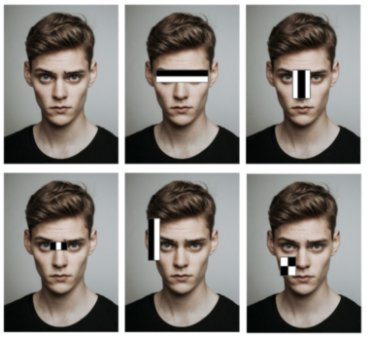

# Viola-Jones-Framework
The <b>Viola-Jones Object Detection Framework</b>, developed by Paul Viola and Michael Jones in <a href="ref1">2001</a>, is an innovative machine learning algorithm specifically designed for fast, accurate face detection. It was primarily motivated by the problem of face detection, although it can be adapted to detect other classes of objects. Training the framework is relatively slow, but it enables objects to be detected quickly and accurately. In fact, it can detect human faces very effectively, and in real time.

Viola–Jones is essentially a boosted feature learning algorithm trained by running a modified AdaBoost algorithm on Haar feature classifiers to find a sequence of classifiers <i>f1, f2, ..., fn</i>. Haar feature classifiers, while simple, allow for very fast computation. The modified AdaBoost algorithm constructs a strong classifier by combining many weak classifiers, enabling accurate and efficient object detection.

The framework consists of several key components that work together to achieve efficient and accurate object detection:
<ol>
  <li>Selecting Haar-like features</li>
  <li>Creating an Integral image</li>
  <li>Running AdaBoost training</li>
  <li>Creating classifier cascades</li>
</ol>
<h3>1. Selecting Haar-like features</h3>
Most images contain universally similar patterns recognizable from a human perspective. For example:
<ul>
  <li>Human Faces: Common patterns include eyes, nose, cheeks, and mouth.</li>
  <li>Four-Wheeler Vehicles: Recognizable patterns include wheels, doors, and steering wheels.</li>
  <li>Buildings: Consistent features include doors, windows, and walls.</li>
</ul>
The concept of Haar-like features was introduced by Alfred Haar in 1909. He developed the "Haar wavelet," a matrix of rescaled square-shaped functions with values ranging between 0 and 1.
Haar-like features, named for their resemblance to 2D Haar wavelets, are key components of the Viola-Jones object detection algorithm. These features use simple rectangular patterns to detect structural components of objects, such as edges, lines, and textures. They are applied to various sub-windows of the image to assess the presence of specific patterns crucial for object recognition.

There are several types of Haar-like features, including:
<ul>
  <li>Edge features</li>
  <li>Line features</li>
  <li>Center features</li>
  <li>Four rectangle features</li>
</ul>

For example, human faces share several common attributes, such as the eye region being darker than the bridge of the nose, and cheeks being brighter than the eye region.

<h2>References</h2>
<ol>
  <li id="ref1">Viola, Paul, and Michael Jones. "Rapid object detection using a boosted cascade of simple features." Proceedings of the 2001 IEEE computer society conference on computer vision and pattern recognition. CVPR 2001. Vol. 1. Ieee, 2001.</li>
  <li id="ref2">Viola, Paul, and Michael J. Jones. "Robust real-time face detection." International journal of computer vision 57 (2004): 137-154.</li>
</ol>
